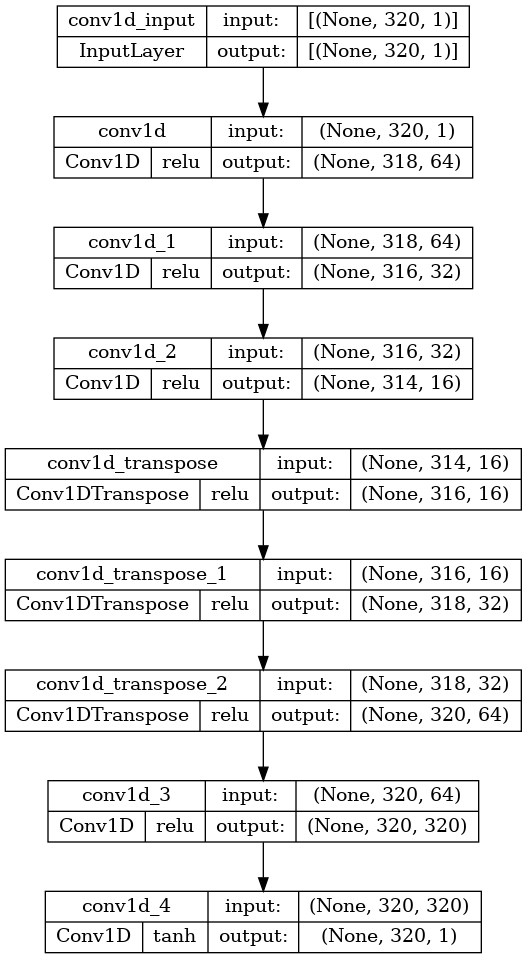

This repository contains codes for my pet project titled “Atom-based vector magnetometer self-calibrated via Deep Learning,” which I started soon after I finished my Ph.D. and while waiting for a visa before I could start my postdoctoral position at UCLA. 

Here I am numerically investigating if applying deep learning (DL) to a microwave-optical double-resonance signal in rubidium vapor can be used to measure the magnitude and orientation of an external magnetic field.

Deconstruction of the title:

- “vector magnetometer” - a device that measures the magnitude and orientation of a magnetic field vector.
- “self-calibrated” -  it does not need any other magnetic-field device for calibration.
- “atom-based” - it relies on quantum effects in atomic rubidium vapor.
- “…via deep learning” - an artificial neural network extracts magnetic field parameters from the optical signal.

## Setup

This project is based on the experimental setup used in my Ph.D. work at the University of Alberta. For detailed information, please see my [Ph.D. thesis](https://era.library.ualberta.ca/items/b0cd4cfb-e3bd-46ac-a270-8950baea0d94) or our [paper](https://arxiv.org/pdf/2110.10673.pdf). Below I present a brief description.

The magnetometer is based on room-temperature rubidium vapor inside a microwave cavity. Depending on the frequency, applying a microwave magnetic field can affect the absorption of laser light passing through the vapor. A linear sweep of the microwave frequency results in an optical absorption pattern consisting of several peaks (sometimes called double resonance or DR). The distance between the peaks depends on the magnitude of an external DC magnetic field, while their relative heights depend on the orientation of the DC field with respect to the cavity axis. There is no analytical expression to relate the DC field angle and the relative peak heights, so I proposed to use deep learning to tackle this problem.

The idea is to feed a recorded photodetector voltage corresponding to the DR signal to a computer algorithm, in our case, a deep neural network, which will return values of $B_{\perp}$ and $B_{||}$.

## Project goals

### Proof of principle

In this project, I am interested in proof-of-principle performance, i.e., I want to see if it is possible to extract the magnetic field parameters from the DR signal via DL. For this purpose, I used synthetic data, i.e., obtained via numerical simulation on a computer, not measured in the lab. 

The results make me confident that this DL approach can be used for real-life magnetic field measurements in a compact, portable device. The sensitivity and accuracy need to be investigated on the actual data.

### Transfer learning

I am interested in investigating if a neural network trained on synthetic data can be applied to real signals via transfer learning. The idea is that it much easier to generate a ton of synthetic data for the training rather than collect it in the lab.

To test that, I used two sets of ******************************synthetic data******************************. One is the vanilla data set, which is supposed to represent the synthetic data used to pre-train the model. It is generated for a free-space microwave field (no cavity linewidth effect on the DR signal). The second set is supposed to represent the actual data. It is generated with a cavity linewidth effect, and some noise is added. 

So far, I have not seen any benefit of transfer learning, but I think it requires more time and effort to be spent on it.

### Conclusions

Initially, I expected it to be a quick and easy pet project. However, as I dug deeper, I discovered that it has more depth and width than I expected. Basically, it can be split into two big research projects (at the M.Sc. level):

- Magnetometer prototype:
    - Collect a lot of diverse real data and use it to train and test the model.
    - Experiment with different model architectures and hyperparameters.
    - The DR signal might require some pre-processing, e.g., to remove the noise (see [reducing_noise_with_autoencoder.ipynb](https://github.com/tretyakovmipt/atomic_magnetometry_DL/blob/main/Training/reducing_noise_with_autoencoder.ipynb)).
- Transfer learning:
    - Generate a much bigger dataset for pre-training.
    - Explore different approaches to transfer learning, e.g., fine-tuning, freezing layers, adding new layers, etc.
    - Experiment with different models and regularization techniques to reduce overfitting.
    - Explore how the noise level and cavity linewidth affect the transfer learning efficiency.

## Contents

I experimented a lot with different network architectures, hyper-parameters, and approaches. I only include the most notable results.

- **Data** contains the datasets used for the training and testing.
- Training contains Jupiter notebooks and a saved pre-trained model.
    - [vanilla-data.ipynb](https://github.com/tretyakovmipt/atomic_magnetometry_DL/blob/main/Training/vanilla-data.ipynb) - pre-trains a model on the vanilla dataset. I compared a fully-connected network with a convolutional network.
    - [transfer-learning.ipynb](https://github.com/tretyakovmipt/atomic_magnetometry_DL/blob/main/Training/transfer-learning.ipynb) - uses the pre-trained model on a new dataset.
    - [reducing_noise_with_autoencoder.ipynb](https://github.com/tretyakovmipt/atomic_magnetometry_DL/blob/main/Training/reducing_noise_with_autoencoder.ipynb) - uses an autoencoder to reduce noise in the signal. I really like the idea of passing a signal through a network with a bottleneck to strip off the noise.
        
        
        
